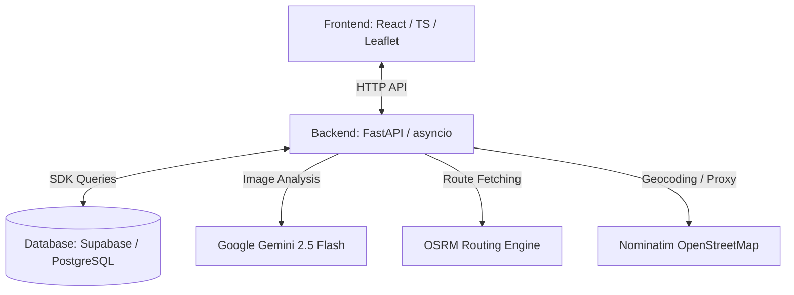
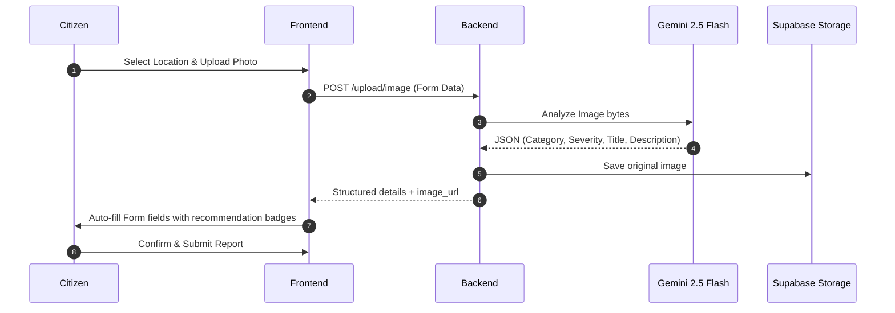
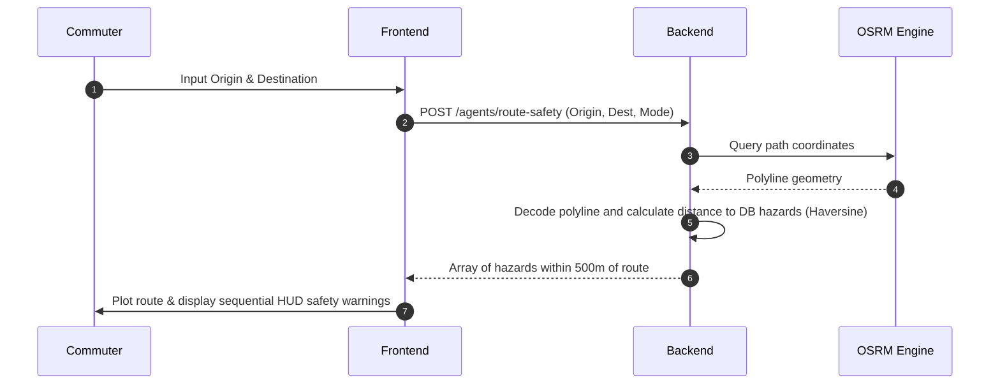

# CivicPulse — Project Context & Architecture 🌐

CivicPulse is an AI-augmented civic issue reporting and routing platform. It empowers citizens to report infrastructure hazards (e.g., potholes, water leakage, broken streetlights, garbage dumps) and leverages a multi-agent system to handle vision analysis, duplicate merging, route safety warnings, and automatic municipal escalation.

---

## 📌 Project Overview

Urban infrastructure issues are often slow to report and hazardous to commuters. CivicPulse addresses this double-sided challenge:
1. **For Citizens**: Provides a simple, mobile-friendly interactive interface to log issues instantly with photos.
2. **For Commuters**: Offers real-time navigation overlay that dynamically warns users about hazardous conditions (like potholes or broken streetlights) along their path.
3. **For Municipalities**: Offers automated grouping of duplicate complaints and scheduled background escalations based on severity and community agreement (voting).

---

## 🛠️ Technology Stack & Dependencies



### 1. Frontend
* **React 18 & TypeScript (Vite)**: Selected for lightning-fast build cycles, component-driven UI architecture, and type-safety across models.
* **Tailwind CSS**: Used to craft custom glassmorphic dashboards, dark mode palettes, and responsive layouts.
* **Leaflet.js & React-Leaflet**: Open-source mapping containers. Used to render spatial data, support pin drops, draw routing polylines, and visualize marker clusters.
* **Lucide React**: Vector-based icons representing issue categories and interface actions.
* **React Hot Toast**: UI notifications and real-time navigation status indicators.

### 2. Backend
* **FastAPI (Python)**: High-performance, asynchronous ASGI framework. Generates automatic OpenAPI/Swagger documentation (`/docs`) and utilizes Pydantic for request-response data validation.
* **asyncio**: Manages background worker threads such as the automatic escalation loop.
* **httpx**: An asynchronous HTTP client used to fetch routes from OSRM and query geocoding features without blocking.

### 3. Database & Storage
* **Supabase (PostgreSQL)**: Serves as the relational database backend containing structured tables for `issues` and `votes`.
* **Supabase Storage**: Manages the public `issue-images` bucket to host image files uploaded by users.

### 4. AI & Routing Engines
* **Google Generative AI (Gemini 2.5 Flash)**: Provides multimodal visual analysis to automatically identify hazard categories, evaluate severity, and generate text summaries from uploaded photographs.
* **OSRM (Open Source Routing Machine)**: Provides street routing engines for Driving, Cycling, and Walking travel modes.
* **Nominatim (OpenStreetMap)**: Provides forward and reverse geocoding to resolve coordinates into human-readable addresses.

---

## 📂 Codebase Directory Structure

```
civicpulse/
├── backend/
│   ├── agents/                   # Multi-agent system logic
│   │   ├── vision_agent.py       # Gemini 2.5 image analyzer
│   │   ├── duplicate_agent.py    # Haversine spatial duplicate checker (100m)
│   │   ├── route_safety_agent.py # OSRM route safety hazard aggregator
│   │   └── escalation_agent.py   # Scheduled issue escalation & upgrading rules
│   ├── routers/                  # API router endpoints
│   │   ├── issues.py             # Issue submission, listings, and voting API
│   │   ├── upload.py             # Image upload handler & vision pipeline orchestrator
│   │   └── agents.py             # Route safety, manual escalation, and diagnostics
│   ├── models.py                 # Pydantic schema models
│   ├── supabase_client.py        # Supabase DB connection config
│   ├── main.py                   # FastAPI app entry point & asyncio background scheduler
│   └── requirements.txt          # Python dependencies
│
├── frontend/
│   ├── src/
│   │   ├── components/           # UI Components
│   │   │   ├── Map.tsx           # Interactive Leaflet map & navigation views
│   │   │   ├── IssueForm.tsx     # Photo upload & report submission modal
│   │   │   ├── IssueDetail.tsx   # Vote, resolve, and issue info sidebar details
│   │   │   ├── NearbyPanel.tsx   # Floating side widget of nearby hazards
│   │   │   ├── NearbyBanner.tsx  # Dynamic navigation indicator warning panels
│   │   │   ├── CivicHealthWidget.tsx # Live diagnostic display & agent checks
│   │   │   └── Sidebar.tsx       # Search panel & reactive issue filters
│   │   ├── utils/                # Helper utilities (distance, user ID session)
│   │   ├── api.ts                # Axios backend API wrapper
│   │   ├── App.tsx               # Main application container
│   │   └── main.tsx              # React mounting file
│   └── package.json              # Frontend npm dependencies
└── README.md                     # Setup instructions & environment specifications
```

---

## ⚙️ How It Works (Core Workflows)

### 1. Vision-Assisted Issue Reporting

* **Process**: When a user selects a file, it is immediately sent to `/upload/image`. The backend runs Gemini analysis asynchronously, uploads the image to Supabase, and returns details. The frontend populates fields as suggestions (indicated by dynamic recommendation badges) so users can submit quickly.

### 2. Proximity-Based Duplicate Detection
* **Process**: Before database insertion in `/issues/`, the backend calls `duplicate_agent.py`. It queries active reports in the database matching the submission category.
* **Mechanism**: Using the **Haversine formula**, it checks if any issue of the same category exists within **100 meters**.
* **Resolution**: If a duplicate exists, the API returns a response flagging it as `merged: true` along with the original issue ID. The frontend alerts the user with a duplicate warning card, increments the validation votes on the original issue automatically, and offers a link to inspect it.

### 3. Hazard-Aware Route Safety & Navigation

* **Process**: Users search for routes (driving, cycling, walking) on the map.
* **Proximity Check**: The `route_safety_agent.py` retrieves the OSRM route, decodes its coordinates, and measures the minimum distance from any point on that route to all active database issues. Any issue within **500 meters** of the path triggers a hazard warning.
* **Dynamic Warning HUD**: While simulating or executing navigation, a top-mounted banner updates color status based on distance to the closest upcoming hazard:
  * 🟢 **Green**: Clear route.
  * 🟡 **Yellow**: Hazard ahead within 800m.
  * 🟠 **Orange**: Hazard warning within 400m.
  * 🔴 **Red (Pulsing)**: Immediate danger within 100m.
* **Sequential Passing Detection**: To prevent alerts from lingering once passed, the app stores a short history of distances to each hazard. If the distance increases for **3 consecutive updates** (tracked via `watchPosition`), the hazard is categorized as `passed` and muted.

### 4. Background Escalation Engine
* **Process**: FastAPI starts a concurrent task runner on server startup (`_escalation_loop` running every 5 minutes in `main.py`).
* **Rules**:
  1. If an issue accumulates $\ge 5$ community verification votes, its severity upgrades from **low** to **medium**.
  2. If it reaches $\ge 10$ votes, severity upgrades from **medium** to **high**.
  3. If an issue remains unresolved and `created_at` exceeds **48 hours**, the title is prepended with `ESCALATED: ` to alert municipal staff.

### 5. Health & Diagnostics
* **Process**: The system tracks the status of all five key internal elements (Vision Agent, Duplicate Agent, Route Safety Agent, Escalation Agent, and Database/Proximity Client) by requesting a health check at `/agents/health`.
* **Visual indicator**: The UI dashboard header displays a status dot (Green for Healthy, Yellow for Degraded, Red for Offline) with a detailed hover tooltip representing individual checks.

---

## 💡 Technology Choice Rationales ("Why We Chose Them")

| Technology | Alternative Considered | Why Chosen |
| :--- | :--- | :--- |
| **FastAPI** | Express (Node.js) or Flask | Built-in async capability makes handling background tasks and heavy external calls (Gemini/OSRM) highly efficient. The Pydantic-based data schema verification removes manual request checking. |
| **React + Vite** | Next.js or Vanilla HTML/JS | Next.js would add unnecessary server-side rendering complexity for what is primarily a Client Map Dashboard. Vite provides instantaneous Hot Module Replacement (HMR) and lightweight builds. |
| **Leaflet.js** | Google Maps SDK | Google Maps charges per tile fetch, which can quickly become expensive. Leaflet is entirely open-source, lighter weight, and supports beautiful custom dark tile schemas (CartoDB Dark Matter). |
| **Google Gemini 2.5 Flash** | OpenAI GPT-4o-mini | Offers rapid inference speeds, low latency, and highly reliable structured JSON output schemas (`gemini-2.5-flash` natively excels at raw data generation without text explanations). |
| **OSRM Engine** | Google Directions API | Free, open-source, and does not require complex API keys or rate-limiting accounts for high-frequency path checking. |
| **Supabase** | Custom Express Backend + MongoDB | Combines PostgreSQL relational capabilities (crucial for spatial coordinates and references) with immediate storage support for image binaries, drastically reducing boilerplate backend code. |
| **Nominatim** | Google Geocoding API | Free reverse-geocoding proxy, eliminating costs for coordinate-to-address conversion during click-to-select events on the map. |
